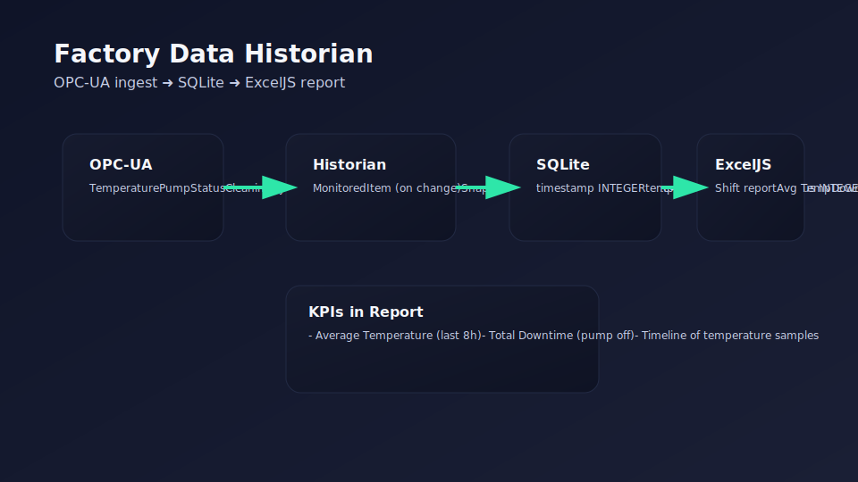

# Portfolio Report – Factory Data Historian

Use this template as a ready handout. Replace the SVG with real screenshots (e.g., Excel report and container logs) after you run the stack.



## Overview
- Project: IIoT Data Historian & Automated Reporting
- Tech: OPC-UA client (`node-opcua`), SQLite storage, ExcelJS reporting, Docker
- Data Model: Temperature + PumpStatus + CleaningCycleID + Overheat_Alarm

## How it works
1. Collector subscribes to OPC-UA Temperature changes and snapshots other nodes.
2. Each change is persisted with a timestamp in SQLite.
3. `generate_report.js` queries the last 8 hours, computes average temperature and downtime, and exports a formatted Excel workbook.

## Quick run
```bash
cd data-historian
docker compose up --build -d
# after data collects
docker compose exec historian node src/generate_report.js
# report appears under ./reports
```

## Evidence to attach
- Screenshot of the generated Excel report (summary rows at bottom).
- Snippet of `src/historian.js` showing the monitored item subscription.
- Short log excerpt from the historian container demonstrating inserts.

## Talking points
- Built a lightweight TSDB on SQLite with indexed timestamps (sufficient for single-machine historian).
- Event-driven ingest avoids polling overhead and keeps backpressure bounded via subscription queue size.
- Reporting flow mirrors shift handover: average temperature and total downtime surfaced directly into Excel.
